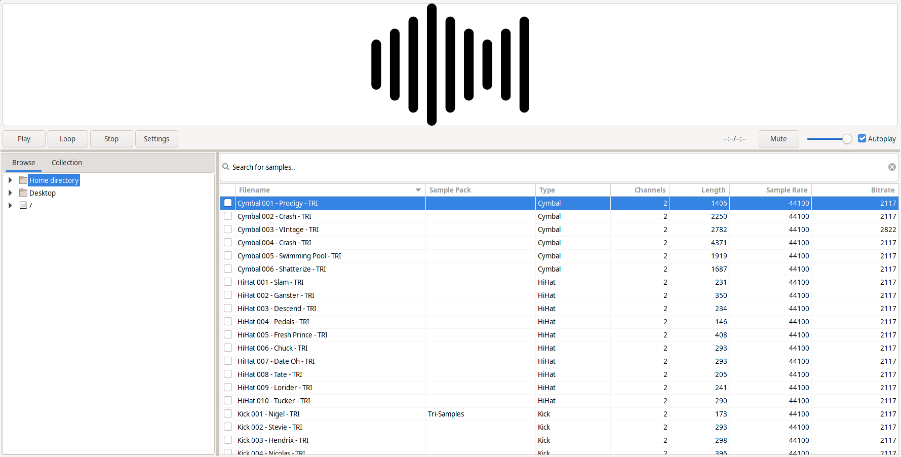

<p align="center">
    
</p>
<h2 align="center">Sample Hive</h2>
<p align="center">
  A simple, modern audio sample browser/manager for GNU/Linux.
  
  <hr>
</p>

## What is Sample Hive?

Sample Hive let's you manage your audio samples in a nice and simple way, just add a directory where you store all your samples, or drag and drop a directory on it to add samples to it, and it will help sort, search, play and view some information about the sample. You can also drag and drop from Sample Hive to other applications.



## Dependencies
On Arch based distributions,

```
sudo pacman -S wxgtk3 wxsvg sqlite taglib yaml-cpp
```

On Ubuntu and Ubuntu based distributions,

```
sudo apt install libwxbase3.0-dev libwxgtk-media3.0-gtk3-dev libwxgtk3.0-gtk3-dev wx3.0-headers libwxsvg-dev libwxsvg3 libsqlite3-dev libyaml-cpp-dev libtagc0-dev libtag1-dev libtagc0 libexif-dev
```

You might also need to install `git`, `meson` and `g++` as well, if you don't already have them installed in order to compile Sample Hive.

## How to build Sample Hive?

Download the source code from this repository or use a git clone:

```
git clone https://gitlab.com/apoorv569/sample-hive
cd sample-hive
meson build
ninja -C build
```
	
## How to run Sample Hive?

To run Sample Hive:

```
cd build
./SampleHive
```

## Some keybindings
// TODO

## Can I configure Sample Hive?

Sample Hive comes with a `config.yaml` file, that you can edit to change some settings for it.
